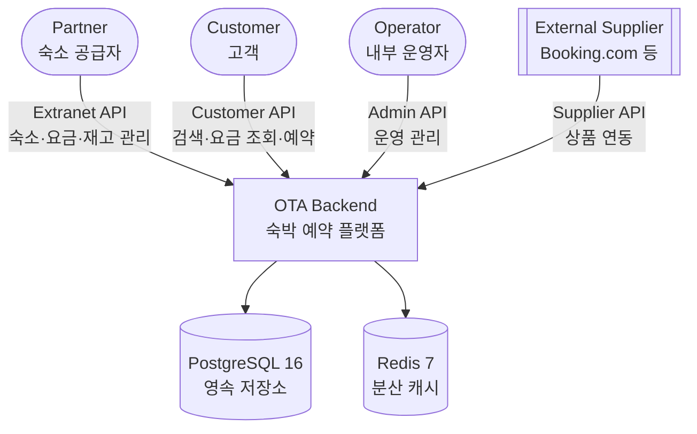

# C4 Level 1 — 시스템 컨텍스트

## 목적

숙박 예약 플랫폼 OTA 백엔드의 전체 시스템 경계, 주요 외부 액터, 그리고 데이터 저장소를 한눈에 파악하기 위함.

## 시스템 컨텍스트

## 외부 액터

| 액터 | 역할 | 주요 유스케이스 |
|------|------|-----------------|
| Partner | 숙소 공급자 | 숙소 등록, 요금·재고 관리 |
| Customer | 고객 | 검색, 예약, 취소 |
| Operator | 내부 운영자 | 운영 모니터링, 파트너 관리 |
| External Supplier | 외부 숙소 공급사 | 상품 피드 제공 |

## 외부 시스템

| 시스템 | 용도 | 연결 방식 |
|--------|------|----------|
| PostgreSQL 16 | 영속 저장 (트랜잭션) | JDBC + Liquibase |
| Redis 7 | L2 분산 캐시 (요금·가용성 조회 가속) | Spring Data Redis |

## 범위 선언

- **포함**: 위 다이어그램 범위 전체
- **제외**: 결제(PG 연동), 리뷰/평점, 추천 랭킹, 푸시 알림

## 관련 문서

- ADR-0001: 언어 및 프레임워크 선정
- ADR-0002: 모듈러 모놀리스 아키텍처
- ADR-0003: 바운디드 컨텍스트 및 CQRS-lite 적용
- `docs/domain/research.md`: OTA 도메인 리서치
